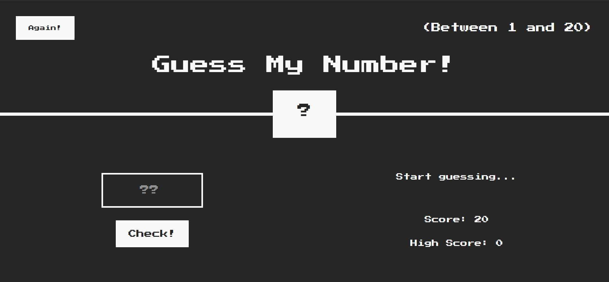

## 📸 Screenshots



# 🎯 Guess Number Game

A responsive number guessing game built with **HTML**, **CSS**, and **JavaScript**. The player tries to guess a randomly generated number, and the game provides helpful feedback after each attempt, indicating whether the guess is too high, too low, or correct.

## 🌐 Live Demo

🔗 [Live Demo](https://ehsan-elahi-dev.github.io/guess-number-game/)

## 🚀 Features

- 🎲 Random number generation
- 💡 Instant feedback for each guess
- 📈 Hints indicating whether the target number is higher or lower
- 🔄 Restart game functionality
- 📱 Fully responsive design for desktop, tablet, and mobile devices
- ✨ Clean and user-friendly interface

## 🛠️ Technologies Used

- HTML5
- CSS3
- JavaScript (Vanilla JS)

## 📂 Project Structure

```text
guess-number-game/
│── index.html
│── style.css
│── script.js
│── screenshots/
│── .gitignore
└── README.md
```

## 🎮 How to Play

1. Enter a number in the input field.
2. Click the **Guess** button.
3. The game will tell you if your guess is **too high**, **too low**, or **correct**.
4. Keep guessing until you find the correct number.
5. Restart the game to play again.

## 📌 Future Improvements

- Difficulty levels
- Score tracking
- Best score system
- Sound effects and animations
- Dark/Light mode

---

Made with ❤️ using HTML, CSS, and JavaScript.
